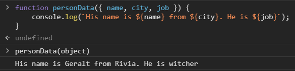

<h2>Czym jest destrukturyzacja?</h2>

Destrukturyzacja oznacza po prostu **rozbicie złożonej struktury na prostsze części.** W JavaScript ta złożona struktura jest zwykle **obiektem lub tablicą.** Dzięki składni ES6 można wydobywać mniejsze fragmenty z tablic i obiektów o wiele szybciej i sprawniej.

<h2>Przykłady</h2>

Jako pierwszy przykład można przyjąć prosty obiekt, w którym znajduje się kilka kluczy razem z wartościami. Niżej zadeklarujemy nową zmienną const, w której podamy dowolne klucze (elementy z obiektu), a po prawej stronie musimy wskazać obiekt, który chcemy destrukturyzować.

W ten sposób stworzą się nam zmienne name i job, które będą mieć w sobie odpowiednie wartości przykładowo:

<h2>Destrukturyzacja w funkcji</h2>

Jako przykład użyję tutaj tego samego obiektu. Niżej tworzymy funkcję, w której przyjmiemy nasz obiekt jako **data**. Następnie wykona się destrukturyzacja i otrzymamy trzy nowe zmienne: **name, city, job.**

Destrukturyzację możemy wykonać jeszcze szybciej - w deklaracji funkcji. Efekt ten sam a sposób jest szybszy i bardziej czytelny:

<h2>Bardziej rozbudowane obiekty (zagnieżdżenia)</h2>

<h2>Destrukturyzacja tablic w JavaScript</h2>

Tak, da się to robić. Sposób jest bardzo podobny do tego z obiektami. Tutaj liczy się kolejność elementów w tablicy i nowo utworzonych zmiennych, do których będziemy przypisywać wartości.

Po destrukturyzacji możemy dowolnie wykorzystywać nasze zmienne (w tym przypadku **one** i **two**).

