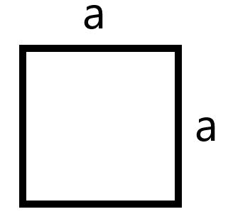
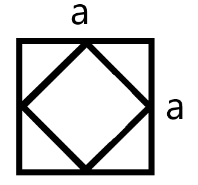
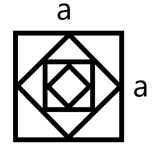
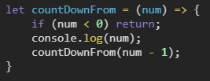
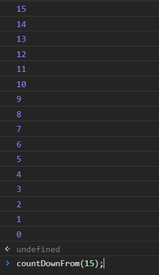

**Rekurencja** (zwana też rekursją) w informatyce to **wywoływanie funkcji przez samą siebie**. Jej zastosowanie możemy znaleźć też w matematyce przy rozwiązywaniu problemu w oparciu wyłącznie o rozwiązania tego samego problemu. Bardzo fajnym przykładem są fraktale - obiekty samopodobne, nieskończenie złożone. Dla lepszego zobrazowania posłużę się przykładem prostego fraktala.

Dla <i>n=1</i> mamy kwadrat o boku równym <i>a</i>

Dla <i>n=2</i> będą to dwa kwadraty (jeden wewnątrz drugiego - tak jak działa właśnie rekurencja) z tym, że ten mniejszy obrócimy o 45 stopni. Wizualizacja poniżej:

A dla <i>n=4</i> będzie to taki fraktal:

<h2>Przykłady w JavaScript</h2>

Przykład, którym się posłużę, pozwoli lepiej zrozumieć **rekurencję** w programowaniu. Będzie to funkcja, która wypisze wszystkie liczby od n do 0.

Funkcja jako argument przyjmuje dowolną liczbę (w tym przykładzie niech będzie to 15). Na samym początku zapisaliśmy dla jakiej wartości działanie funkcji powinno zostać przerwane (gdybyśmy tego nie zrobili, funkcja wykonywałaby się od 15 do minus nieskończoności.

Ostatnia linia funkcji to **wywołanie samej siebie** i odjęcie 1 od obecnej wartości. Wynik tej funkcji wygląda następująco:

Za jakiś czas postaram się zamieścić więcej przykładów **rekurencji w JavaScript**.
